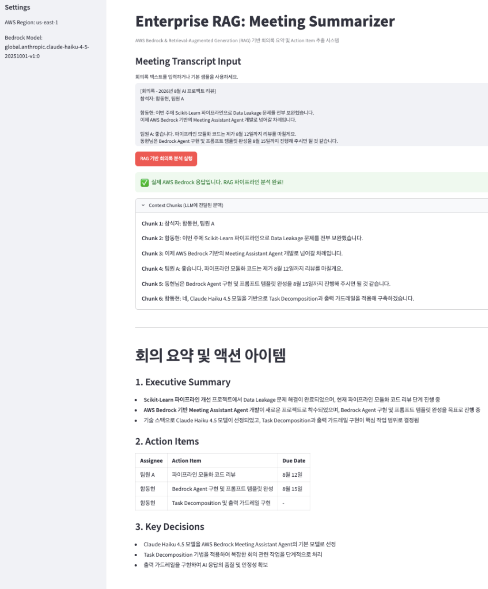
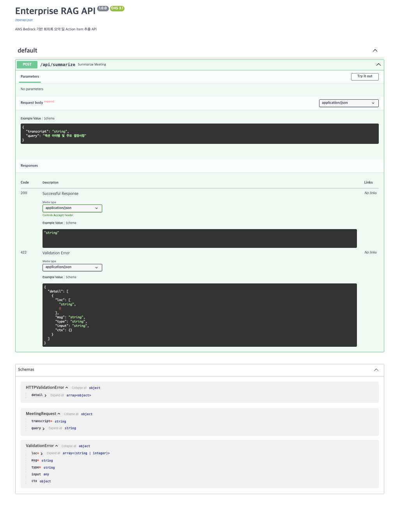

# 05_Enterprise_RAG_Agent

## 라이브 데모
아래 링크에서 실제 AWS Bedrock(Claude Haiku 4.5) 연동 결과를 바로 확인할 수 있다.

https://ai-ml-portfolio-eda-model-comparison-regression-and-genai-apps.streamlit.app/

## 프로젝트 개요
본 프로젝트는 AWS Bedrock 기반 RAG 시스템으로, 비구조화된 기업 회의록 및 텍스트 데이터를 분석하여 핵심 안건, 담당자, 이행 기한이 포함된 구조화된 Action Item으로 자동 변환하는 시스템입니다.

---

## Tech Stack
- LLM & Cloud Services: AWS Bedrock (Claude Haiku 4.5, Titan Text Embeddings V2)
- Backend: FastAPI, Uvicorn, Pydantic
- Frontend: Streamlit
- Data / ML: Python 3.9 이상, Scikit-learn (TF-IDF, Cosine Similarity), boto3
- Infra: Docker, python-dotenv
- Prompt Engineering: Task Decomposition, Persona Setting, Output Format Safeguard

---

## Architecture & Workflow

1. Task Decomposition (추론 단계 분할)
   - 단일 프롬프트 방식의 한계를 극복하기 위해 [회의록 분석] -> [안건 분류] -> [Action Item 추출]로 추론 단계를 분할하여 처리 정밀도 향상

2. Persona & Safeguard 적용
   - 페르소나 정의 및 엄격한 Output Format 제약 조건을 설정하여 환각(Hallucination) 현상 방지

3. Action Item Generation
   - 최종 추출된 결과를 담당자별, 우선순위별 구조화된 문서(Markdown/JSON) 형태로 자동 출력

---

## 리트리벌 방식 비교: TF-IDF vs Titan Embeddings

프로젝트 초기에는 TF-IDF 기반의 얕은 리트리벌을 사용했으나, 이후 AWS Bedrock Titan Text Embeddings V2(1024차원 벡터)를 도입해 두 방식을 comparison_results.json 기준으로 정량 비교했다.

### 비교 결과
- 히트율: TF-IDF 83.3퍼센트(6건 중 5건), Titan Embedding 83.3퍼센트(6건 중 5건)로 동일
- 속도: TF-IDF 평균 약 0.002초(질의별 0.001-0.003초), Titan Embedding 평균 약 5.0초(질의별 2-7초)로 TF-IDF가 훨씬 빠름
- 두 방식 모두 동일한 케이스(신규 인턴 온보딩 자료 관련 질의)에서 실패

### 실패 원인 분석
실패는 리트리벌 알고리즘 자체의 문제가 아니라, 회의록을 줄 단위로 청킹하는 방식에서 비롯된 구조적 한계로 확인됐다. 질문 문장과 답 문장이 서로 다른 청크로 분리되면서, 질문끼리의 유사도가 질문과 답 사이의 유사도보다 높게 나오는 현상이 원인이었다.

### 추가 개선: 짧은 회의록의 요약 누락 문제
배포 준비 중 짧은 회의록 요약 시 TF-IDF 검색이 질문과 무관해 보이는 발언(유사도 0)을 제외시켜, 실제로는 중요한 Action Item이 누락되는 문제를 발견했다. 특정 질의에 답할 때는 검색이 유효하지만, 전체 요약이 목적일 때는 모든 발언이 빠짐없이 전달돼야 한다는 걸 확인했다. 이에 따라 회의록 길이가 2,000자 이하이면 전체 문맥을 그대로 전달하고, 이를 초과할 때만 TF-IDF 검색을 적용하도록 수정했다.

### 기본값 결정
정확도가 동일한 조건에서는 더 빠른 방식을 채택하는 것이 합리적인 엔지니어링 판단이라 보고, process_transcript의 기본 리트리벌 방식은 TF-IDF로 유지했다. Titan Embeddings 기반 함수(retrieve_relevant_chunks_embedding)는 코드베이스에 남겨두어, 향후 청킹 전략 개선 시 재검증할 수 있도록 했다.

---

## 실행 방법

### 환경변수 설정
.env.example을 참고해 .env 파일을 생성하고 AWS Credential을 입력한다.

### 로컬 실행
cd 05_Enterprise_RAG_Agent
pip install -r requirements.txt
uvicorn app.main:app --reload --port 8000

FastAPI 서버가 뜨면 별도 터미널에서 Streamlit UI를 실행한다.
streamlit run app/streamlit_app.py

### Docker 실행
cd 05_Enterprise_RAG_Agent
docker build -t rag-agent .
docker run -p 8000:8000 --env-file .env rag-agent

---

## 실행 화면

### Streamlit UI, 실제 AWS Bedrock 연동 결과

회의록을 입력하고 RAG 기반 회의록 분석 실행 버튼을 누르면, 회의록 길이에 따라 전체 문맥 또는 TF-IDF 리트리벌 결과를 AWS Bedrock(Claude Haiku 4.5) API에 전달해 Executive Summary, Action Items, Key Decisions를 구조화된 형태로 생성한다. 초록색 안내 문구는 mock이 아닌 실제 Bedrock 응답임을 확인해준다.

### FastAPI Swagger UI, POST /api/summarize

Pydantic으로 정의한 MeetingRequest 스키마(transcript, query 필드)와 요청/응답 예시, 422 Validation Error 스펙까지 자동 생성된 API 문서다.

---

## 주요 성과 및 인사이트
- 정형화되지 않은 텍스트 데이터를 즉시 실행 가능한 결론으로 자동 변환하여 문서 작성 및 요약 시간 단축
- 시스템 프롬프트 가드레일 설정을 통해 환각률 최소화 및 출력 일관성 확보
- Task Decomposition 기반 프롬프트 체인 설계를 통한 복잡한 추론 문제 해결 역량 검증
- TF-IDF와 Titan Embeddings 두 리트리벌 방식을 정량 비교 검증하고, 실패 원인을 청킹 구조 문제로 규명하여 근거 기반 기술 선택 역량 검증
